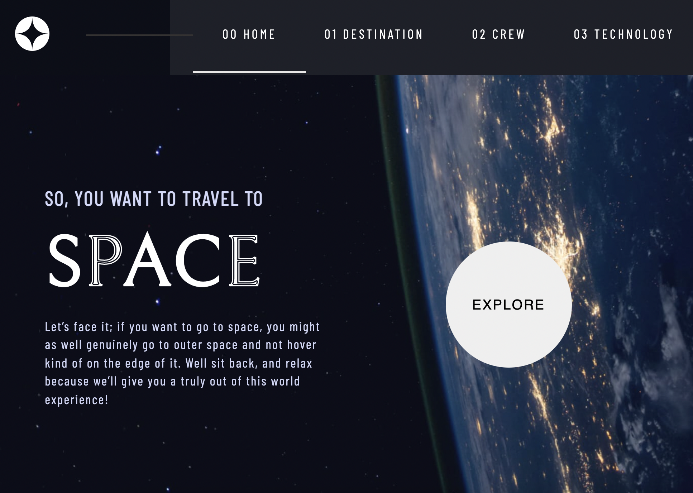
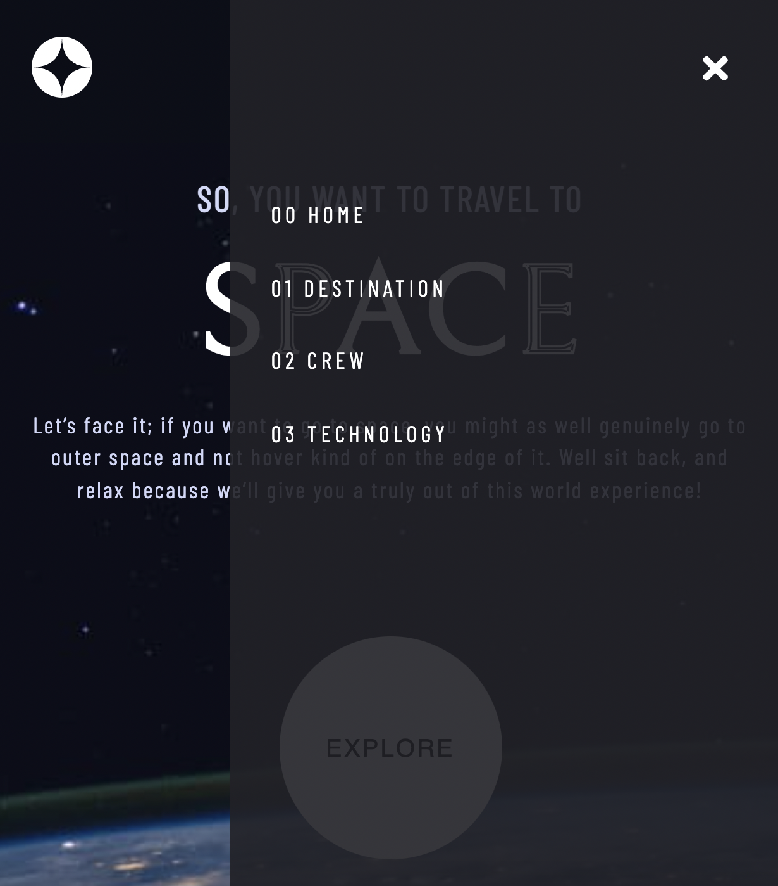
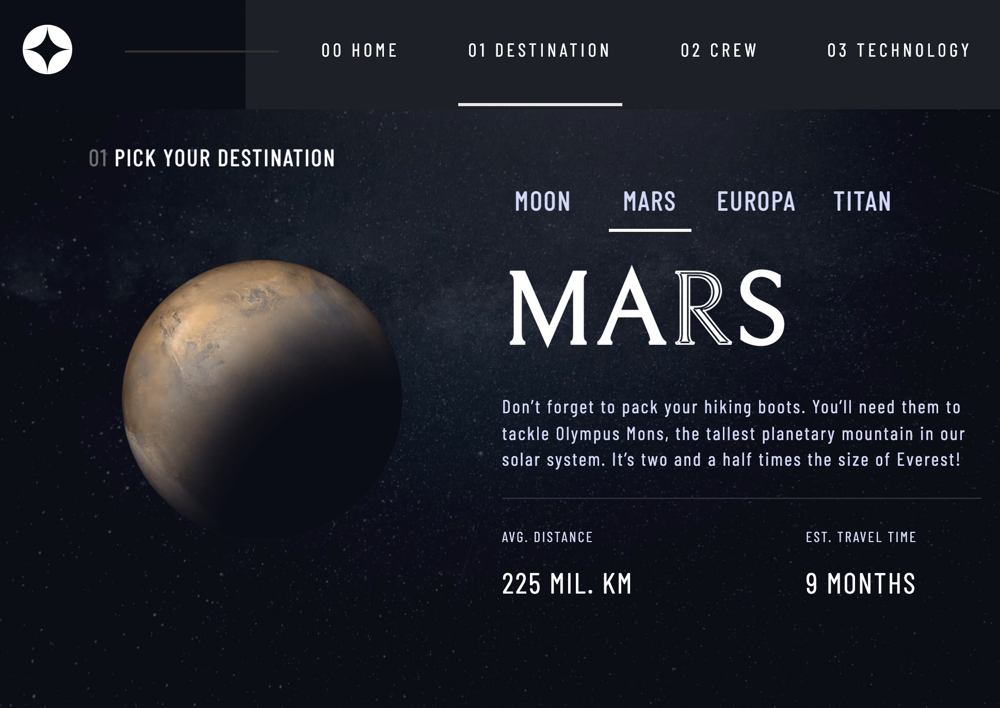
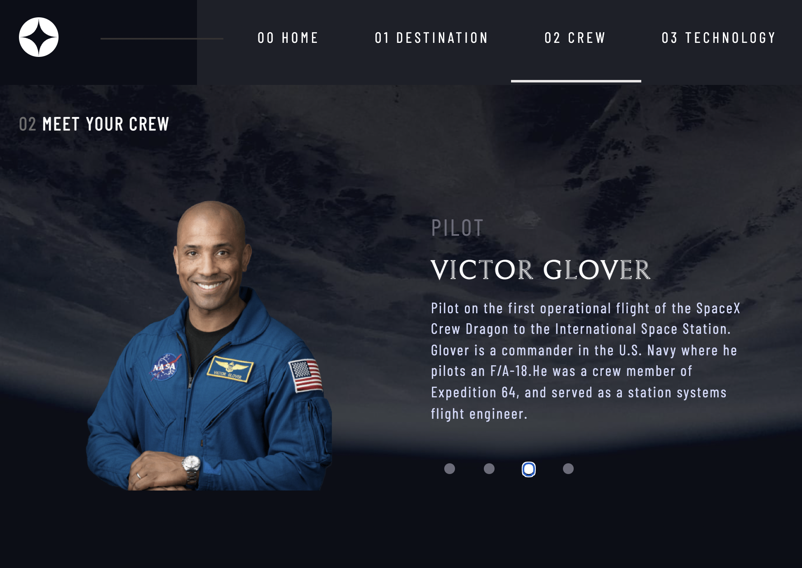
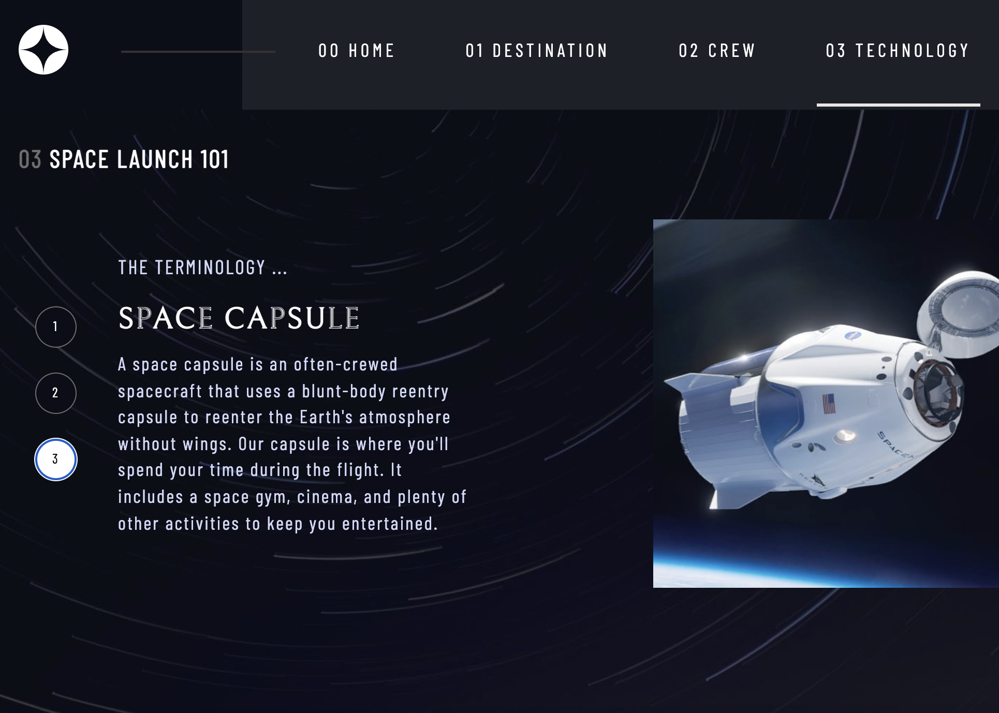

## Space tourism multi-page website // Frontend Mentor Project // React and CSS

- [see project](https://sweta-space-tourism-website-fm.netlify.app)
- The project is a multi-page website about space travel
- data is in local data.json file

    

 

    

 

    

 

    

 

    

 

#### Comments about the code

#### Helpers

https://programmerah.com/hmr-waiting-for-update-signal-from-wds-33648/
